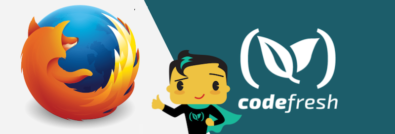

# Decryption with Mozilla SOPS

This is a sample application that uses Mozilla SOPS to decrypt a credentials file.

Note that if you install this locally (`mvn clean install`) the build will fail, as the tests will not have access to the proper enviornment variable that was exported to the pipeline via the plugin.

## Prerequisites

- A [free Codefresh account](https://codefresh.io/docs/docs/getting-started/create-a-codefresh-account/)
- A public and private GnuGP key pair
- A credentials yaml, that is encrypted using Mozilla SOPS, and stored in your repository

## Example Usage

Add your private key as an environment variable, `PRIV_KEY`, either in the YAML or through the Codefresh UI.  See the [documentation] (https://codefresh.io/docs/docs/yaml-examples/examples/decryption-with-mozilla-sops/) for more details.

[Example pipeline](codefresh.yaml)
